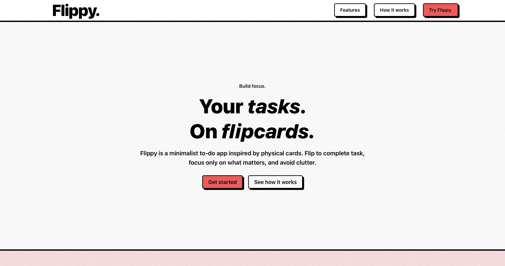

<h2 align="center">Hello, <a href="https://github.com/leemasdeef" 
  title="Profile">I'm Samil</a>👋</h2>
 

  Full-stack developer. 
  I enjoy being given challenging, visually-pleasing designs and making them a reality.  
  I prefer simple yet visually-striking designs.  
  
  
  📫 How to reach me:

  
  

 

<h1 align="center">🚀 Languages & Tools</h1>

<h3 align='center'>🏝️ Front End</h3>

<table align="center">
  <tr>
    <td align="center" height="70" width="70">
      
       HTML5
    </td>
    <td align="center" height="70" width="70">
      
       CSS3
    </td>
    <td align="center" height="70" width="70">
      
       JavaScript
    </td>
    <td align="center" height="70" width="70">
      
       TypeScript
    </td>
    <td align="center" height="70" width="70">
      
       React
    </td>
  </tr>
  <tr>
    <td align="center" height="70" width="70">
      
       Next.js
    </td>
    <td align="center" height="70" width="70">
      
       React Native
    </td>
    <td align="center" height="70" width="70">
      
       Expo
    </td>
    <td align="center" height="70" width="70">
      
       Styled Components
    </td>
  </tr>
</table>

<h3 align='center'>👷🏻 Back End</h3>

<table align="center">
  <tr>
    <td align="center" height="70" width="70">
      
       ExpressJS
    </td>
    <td align="center" height="70" width="70">
      
       Drizzle
    </td>
    <td align="center" height="70" width="70">
      
       PostgreSQL
    </td>
    <td align="center" height="70" width="70">
      
       MongoDB
    </td>
  </tr>
</table>

<table>
  <tr>
    <!-- <td width='50%'></td> -->
     <td width='50%' colspan=2>
      <h2 align='center'>Flippy</h2>
      
  
        
         
         
        
<strong>React, TypeScript, NextJS, Drizzle, Betterauth </strong>

      

    </td>
  </tr>
  <tr>
    <td width='50%'>
      <h2 align='center'>Memory Card Game</h2>
      
  
        
         
         
        
<strong>React, Javascript, Vite </strong>

      

    </td>
    <td width='50%'>
      <h2 align='center'>Weather App</h2>
      
  
        
         
         
        
<strong>HTML, CSS, Javascript</strong>

      

    </td>
  </tr>
  <tr>
    
